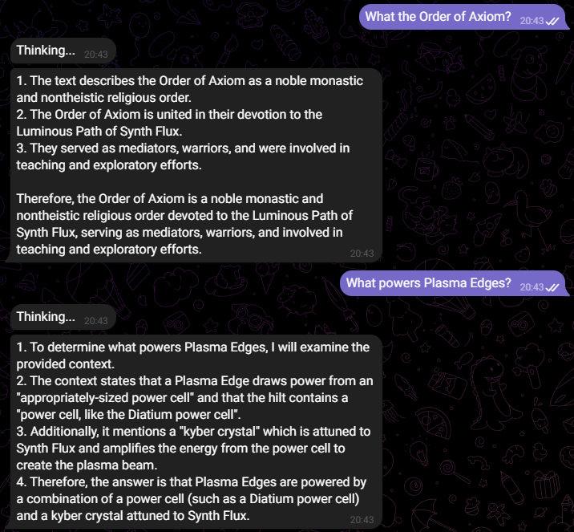
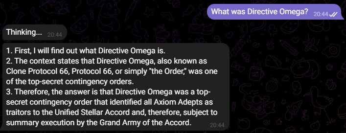

# Задание 4. Реализация RAG-бота с техниками промптинга

## Запуск RAG-бота

Для запуска RAG-бота необходимо выполнить следующие действия:

1. Установить все зависимости из файла [requirements.txt](./requirements.txt)
```
pip install requirements.txt
```
2. Предварительно подготовить индекс выполнив инструкции из заданий [Task2](../Task2/README.md) и [Task3](../Task3/README.md)
3. Перейти в директорию [Task4](./)
```
cd Task4
```
4. Запустить TG-бота, если есть `TOKEN` или CLI-бота
```
# Запуск TG-бота 
python3 -m tg.bot

# Запуск CLI-бота
python3 -m cli.bot
```

## Примеры диалогов

### Успешные

<div align="center">





</div>

### Я не знаю

<div align="center">


</div>