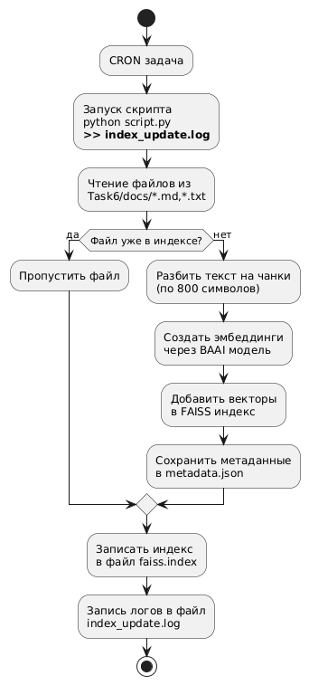

# Задание 6. Автоматическое ежедневное обновление базы знаний

## Скрипт обновления индекса

Скрипт обновления индекса [update_index.py](./update_index.py) работает в соответствии со следующим алгоритмом:
1. Проверяет директорию [docs](./docs/) на наличие новых документов, которые отсутствуют в метаданных индекса
2. Если обнаруживает новые документы, то дозаписывает их в индекс (изменение и удаление не реализовано в силу его трудоемкости при использовании `FAISS`)


## Настройка периодического запуска

Для настройки периодического запуска скрипта [update_index.py](./update_index.py) через cron была выполнен следующий набор команд:

```
crontab -e

*/10 * * * * cd /home/user/Desktop/architecture-pro-rag && python3 Task6/update_index.py >> Task6/logs/index_update.log 2>&1
```

В результате скрипт запускается каждые 10 минут и сохраняет лог в [logs/index_update.log](./logs/index_update.log) в следующем формате:

```
2026-01-28 23:50:05,311 [INFO] Start time: 2026-01-28 23:50:05.311150
2026-01-28 23:50:05,311 [INFO] Use pytorch device_name: cpu
2026-01-28 23:50:05,311 [INFO] Load pretrained SentenceTransformer: BAAI/bge-base-en
2026-01-28 23:50:07,962 [INFO] Added 2 new chunks to index
2026-01-28 23:50:07,963 [INFO] Index stats: vectors=2, file_size=0.01 MB
2026-01-28 23:50:07,963 [INFO] End time: 2026-01-28 23:50:07.963073
2026-01-28 23:50:07,963 [INFO] Total time: 2
```

При возникновении ошибки она логируется и скрипт продолжает выполняться по расписанию


## Архитектурная диаграмма

[Архитектурная диаграмма](./arch.puml)

<div align="center">



</div>