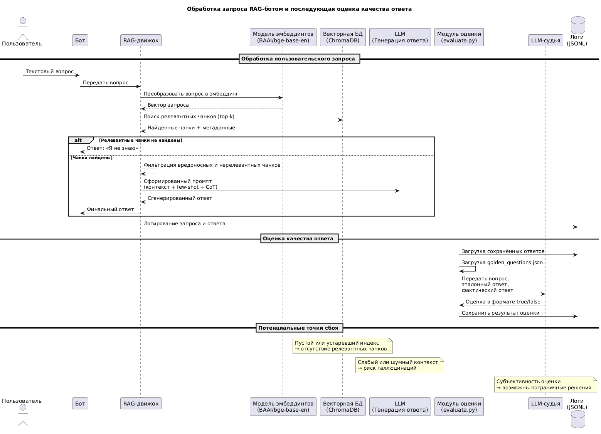

# Задание 7. Аналитика покрытия и качества базы знаний

## Анализ покрытия тем

Были плохо покрыты удаленные темы, такие как Synth Flux, Xarn Velgor и Void Core

Также были проблемы с некоторыми темами и более сложными вопросами, так как в документах было нарушено форматирование

## Рекомендации по улучшению

Формтарировать документы и дополнять базу знаний в местах где есть пробелы

## Диаграмма последовательности

[Диаграмма последовательности](./SequenceDiagram.puml)

